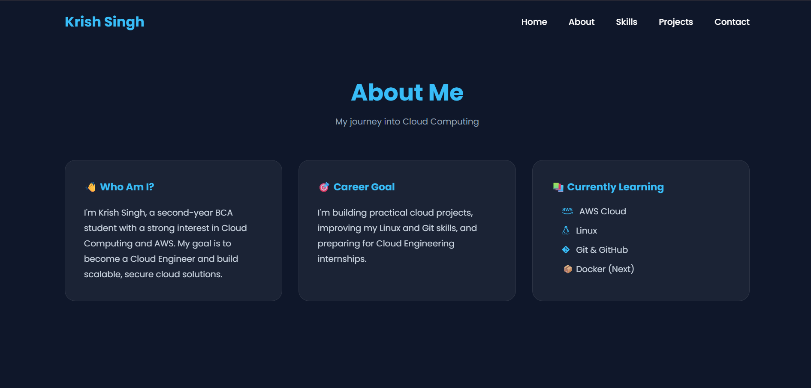
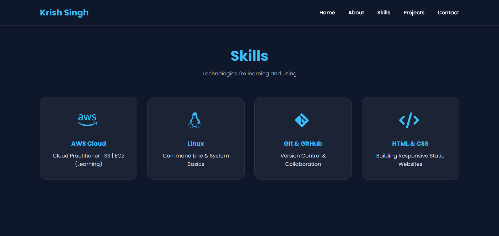
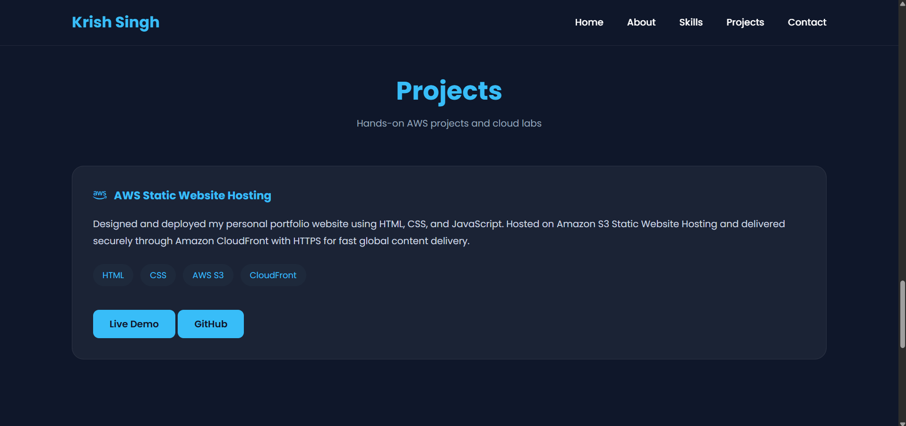
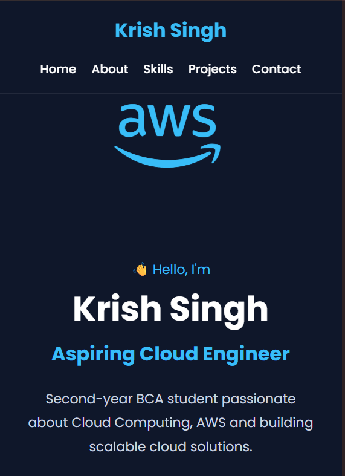

# AWS Static Portfolio Website

A responsive personal portfolio website deployed on AWS using Amazon S3 and Amazon CloudFront.

The project demonstrates cloud deployment, secure content delivery over HTTPS, and AWS best practices for hosting static websites.

---

## Live Demo

**Website:**
https://d2lk2nhp66uyva.cloudfront.net


---


## Architecture

This website is hosted on **Amazon S3 Static Website Hosting** and delivered globally through **Amazon CloudFront**, which provides HTTPS, caching, and faster content delivery.

### Architecture Diagram

.png)


---

## AWS Services Used

- Amazon S3
- Amazon CloudFront
- AWS IAM
- AWS Identity Center
- AWS Free Tier

---

## Features

- Responsive portfolio website
- Static website hosting
- HTTPS using CloudFront
- Global content delivery
- Downloadable AWS certificates
- Git version control
- GitHub repository

---

## Technologies

- HTML5
- CSS3
- JavaScript
- Git
- GitHub
- AWS

---

## Project Structure

```
AWS-STATIC-PORTFOLIO-WEBSITE/
│
├── Architecture/
├── Docs/
├── Screenshots/
├── assets/
├── index.html
├── style.css
├── script.js
└── README.md
```

---

## Screenshots

### Homepage


---

### About Section



---

### Skills



---

### Projects


---

### Mobile View


---

## Deployment Steps

1. Developed website using HTML, CSS and JavaScript.
2. Uploaded files to Amazon S3.
3. Enabled Static Website Hosting.
4. Configured Bucket Policy.
5. Created CloudFront Distribution.
6. Enabled HTTPS.
7. Tested website.
8. Published project on GitHub.

---

## Learning Outcomes

- Amazon S3 Static Website Hosting
- IAM Users
- IAM Permissions
- Bucket Policies
- CloudFront Distribution
- HTTPS Delivery
- Cache Invalidation
- Git Workflow
- GitHub Workflow

---

## Future Improvements

- Route 53
- Custom Domain
- ACM Certificate
- CI/CD with GitHub Actions
- Visitor Counter (Lambda + DynamoDB)

---

## Author

**Krish Singh**

GitHub:
https://github.com/krish307

LinkedIn:
LinkedIn:
https://www.linkedin.com/in/krishsingh0001